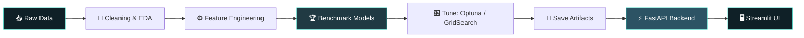

<div align="center">


<a href="https://github.com/ENGABHAY">
  
</a>

<br/><br/>

[](https://linkedin.com/in/kadamabhay)
[](mailto:kadamabhay54@gmail.com)
[](https://github.com/ENGABHAY)


</div>


## 👨‍💻 &nbsp;About Me

<table>
<tr>
<td width="55%" valign="top">

```python
class Abhay:
    role      = ["Data Scientist", "ML Engineer", "AI Engineer"]
    education = "B.Tech, Electronics & Computer Engg (2026)"
    college   = "Jawaharlal Nehru Engineering College"
    location  = "Hyderabad, India  |  PAN India / Remote"

    focus_now = ["LLMs", "RAG pipelines",
                 "LangChain", "Prompt Engineering"]

    approach  = [
        "Benchmark many models, keep the honest winner",
        "Document what failed, not just what worked",
        "Ship every project with an API + a UI",
    ]

    def open_to(self):
        return "Full-time roles & internships 🚀"
```

</td>
<td width="45%" valign="top">

### ⚡ Quick Facts

- 🔭 Building **RAG apps** with LangChain + Groq
- 🎯 Targeting **DS / ML / AI Engineer** roles
- 🧪 **13 model configs** benchmarked on one vision task
- 📈 **300K+ record** datasets, from loans to hospital stays
- 🧠 Hands-on with **CV, NLP, time series & GenAI**
- 🚢 Deploy with **FastAPI + Streamlit**

</td>
</tr>
</table>


## 🛠️ &nbsp;Tech Arsenal

<div align="center">

**Languages & Data**


**Machine Learning & Deep Learning**


**Backend, Apps & Deployment**


**Cloud & DevOps (foundational)**


<br/>


</div>

<details>
<summary><b>📚 Skills by domain (click to expand)</b></summary>
<br/>

| Domain | What I work with |
|:--|:--|
| 🔢 **Classical ML** | Feature engineering, imbalanced data (SMOTE), Optuna tuning, GridSearchCV / RandomizedSearchCV, CatBoost, XGBoost, Ridge |
| 🧠 **Deep Learning** | CNNs, transfer learning (MobileNetV2, EfficientNetB0), ANNs, TensorFlow / Keras |
| 👁️ **Computer Vision** | OpenCV, YOLOv8 custom training, Haar cascades, real-time video pipelines |
| 💬 **NLP & GenAI** | Sentence embeddings, UMAP + HDBSCAN clustering, BART / Gemini summarization, RAG, LangChain, ChromaDB, Groq |
| 📉 **Time Series** | ARIMA, SARIMAX, Prophet, Holt-Winters, chronological validation |
| 🚢 **Deployment** | FastAPI endpoints, Streamlit dashboards, joblib / Keras model artifacts |
| ☁️ **Cloud & DevOps** | Foundational knowledge of Docker, Kubernetes and AWS |
| 🗄️ **Data & Analytics** | SQL (MySQL), EDA, Pandas, NumPy, Plotly, Matplotlib, Seaborn |

</details>


## 🚀 &nbsp;Featured Projects

<div align="center">

<table>
<tr>
<td align="center" width="33%">

### 🤖 AI Documents Chatbot
*Chat with any document*


Answers questions **only from the uploaded file**. Supports PDF, TXT, DOCX, CSV, XLSX, PPTX and HTML with MMR retrieval.

[**View Repo →**](https://github.com/ENGABHAY/Ai-Documents-Chatbot-Langchain)

</td>
<td align="center" width="33%">

### 🎥 AI Smart Proctoring
*Real-time cheating detection*


Custom YOLOv8n model flags phones, books, headphones and extra people. **mAP50 0.931 · Recall 0.932**

[**View Repo →**](https://github.com/ENGABHAY/AI-Smart-Proctoring-System)

</td>
<td align="center" width="33%">

### 📰 News Event Clustering
*Articles → events → timelines*


**209,508 articles** grouped into **4,820 events**, summarized with BART / Gemini.

[**View Repo →**](https://github.com/ENGABHAY/AI-News-Event-Clustering-Timeline-Builder)

</td>
</tr>
</table>

</div>

### 📦 &nbsp;Machine Learning Portfolio

<div align="center">

| | Project | What it does | Stack | Headline result |
|:-:|:--|:--|:--|:--|
| 🏦 | [**Home Loan Default Predictor**](https://github.com/ENGABHAY/Home-Loan-Default-Predictor) | Scores default risk (Low / Medium / High) for ~300K applicants from 7 relational tables, 209 engineered features | `CatBoost` `Optuna` `FastAPI` `Streamlit` | ROC-AUC **0.7907** |
| 🏥 | [**Hospital Stay Prediction**](https://github.com/ENGABHAY/hospital-stay-prediction) | Binary and 11-class length-of-stay prediction on ~318K records, plus patient clustering | `XGBoost` `UMAP` `HDBSCAN` `FastAPI` | Binary + multiclass pipelines |
| 🦠 | [**COVID-19 Forecasting**](https://github.com/ENGABHAY/Covid-19-Forecasting) | 5 time-series models and 8 regressors benchmarked on JHU CSSE data for 266 countries | `ARIMA` `Prophet` `SARIMAX` `Ridge` | Accuracy **90.01%** · R² **0.6355** |
| 🎫 | [**ABC Tech ITSM Analytics**](https://github.com/ENGABHAY/ABC-Tech-ITSM) | Ticket priority classification, daily volume forecasting, RFC risk prediction on 46K+ incidents | `CatBoost` `SARIMAX` `FastAPI` | Priority ROC-AUC **0.9414** |
| 🌾 | [**Rice Leaf Disease Detection**](https://github.com/ENGABHAY/Rice-Disease-Prediction-Deep-Learning) | 3-class disease classifier; 13 configurations benchmarked, failures documented | `MobileNetV2` `TensorFlow` `FastAPI` | Test accuracy **95.83%** |
| 👥 | [**HR Attrition Predictor**](https://github.com/ENGABHAY/HR-Employee-Attrition-Predictor) | SMOTE-balanced ANN for IBM HR attrition with a risk-gauge dashboard | `TensorFlow` `SMOTE` `FastAPI` | End-to-end pipeline |

</div>

<details>
<summary><b>🔬 Engineering notes: what I learned the hard way</b></summary>
<br/>

- **Leakage matters.** In the ITSM project I excluded `Impact` and `Urgency` as features, since together they define the priority target and the model would just learn a lookup table. Splits were chronological throughout.
- **Failures are data.** EfficientNetB0 sat at 33.33% because of a preprocessing mismatch (expects `[0,255]`, got `[0,1]`). Fine-tuning MobileNetV2 on 119 images degraded it to 54.17%. Both are documented in the repo.
- **Pin your versions.** A scikit-learn mismatch caused a `_RemainderColsList` crash when loading a saved preprocessor; pinning `scikit-learn==1.6.1` fixed it.

</details>


## 🏗️ &nbsp;How I Ship ML

<div align="center">



</div>


## 🎓 &nbsp;Education & Certifications

<table>
<tr>
<td width="50%" valign="top">

### 🎓 Education
**B.Tech, Electronics & Computer Engineering**
Jawaharlal Nehru Engineering College
*Graduating 2026 · CGPA 7.65*

</td>
<td width="50%" valign="top">

### 🏅 Certifications
- **Oracle Cloud Infrastructure 2025**: Certified AI Foundations Associate
- **Complete Data Analyst Bootcamp**: Udemy
- **Python: Working with Predictive Analytics**: LinkedIn Learning

</td>
</tr>
</table>


## 📊 &nbsp;GitHub Analytics

<div align="center">


<br/>


</div>

<details>
<summary><b>🐍 Contribution snake (needs one-time setup, see note)</b></summary>
<br/>
<div align="center">

<picture>
  <source media="(prefers-color-scheme: dark)" srcset="https://raw.githubusercontent.com/ENGABHAY/ENGABHAY/output/github-snake-dark.svg" />
  <source media="(prefers-color-scheme: light)" srcset="https://raw.githubusercontent.com/ENGABHAY/ENGABHAY/output/github-snake.svg" />
  
</picture>

</div>
</details>


## 🤝 &nbsp;Let's Build Something

<div align="center">

I'm looking for **Data Science, ML and AI Engineering** roles, in India or remote.
If you're working on something interesting with data or LLMs, say hi.

<br/>

[](https://linkedin.com/in/kadamabhay)
[](mailto:kadamabhay54@gmail.com)

<br/>


<br/>


</div>
