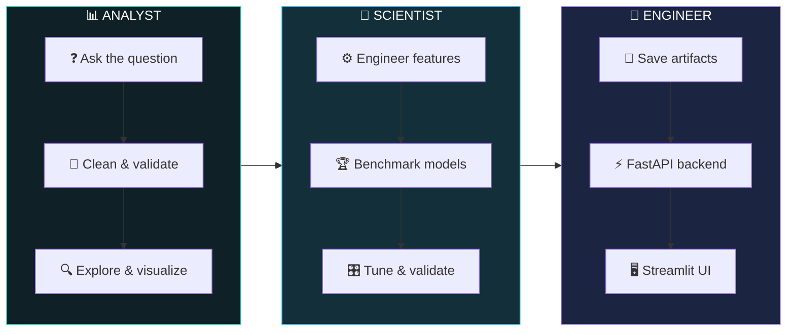

<div align="center">



<a href="https://github.com/ENGABHAY">
  
</a>

<br/><br/>

[](https://linkedin.com/in/kadamabhay)
[](mailto:kadamabhay54@gmail.com)


<br/>

**[🎭 Roles](#-three-hats-one-engineer)** &nbsp;·&nbsp; **[🛠️ Stack](#️-tech-arsenal)** &nbsp;·&nbsp; **[🚀 Projects](#-featured-projects)** &nbsp;·&nbsp; **[📈 Analytics Work](#-data-analysis-work)** &nbsp;·&nbsp; **[🏗️ Workflow](#️-how-i-work)** &nbsp;·&nbsp; **[🤝 Contact](#-lets-build-something)**

</div>


## 👨‍💻 &nbsp;About Me

<div align="center">

<table>
<tr>
<td valign="top">

```python
class Abhay:
    roles     = ["Data Analyst", "Data Scientist",
                 "AI Engineer", "ML Engineer"]
    education = "B.Tech, Electronics & Computer Engg (2026)"
    college   = "Jawaharlal Nehru Engineering College"
    base      = "Hyderabad, India  |  PAN India / Remote"

    learning  = ["Agentic AI", "LangGraph", "MCP",
                 "Tool Calling", "Agent Evaluation"]

    principles = [
        "Question the data before modeling it",
        "Benchmark many models, keep the honest winner",
        "Document what failed, not just what worked",
        "Ship every project with an API + a UI",
    ]

    def open_to(self):
        return "Full-time roles & internships 🚀"
```

</td>
</tr>
</table>

</div>


## 🌱 &nbsp;Currently Learning

<div align="center">

```
Prompt Engineering  ──▶  RAG  ──▶  MCP  ──▶  AI Agents
```

<table>
<tr>
<td align="center" width="33%" valign="top">

### 📚 RAG


Retrieval-Augmented Generation: grounding LLM answers in your own documents instead of guesses.

`LangChain` `ChromaDB` `Groq`

[**See my RAG project →**](https://github.com/ENGABHAY/Ai-Documents-Chatbot-Langchain)

</td>
<td align="center" width="33%" valign="top">

### 🔌 MCP


Model Context Protocol: the open standard for connecting LLM apps to tools and data sources.

`Tools` `Servers` `Context`

</td>
<td align="center" width="33%" valign="top">

### 🤖 AI Agents


LLM agents that plan, call tools and finish multi-step tasks on their own.

`Tool Calling` `LangGraph` `ReAct` `Evals`

</td>
</tr>
</table>

</div>


## 🎭 &nbsp;Three Hats, One Engineer

<div align="center">

<table>
<tr>
<td align="center" width="33%" valign="top">

### 📊 Data Analyst
*Find the story in the data*

`SQL` `Excel` `Power BI` `Tableau` `Pandas` `EDA`

Clean messy tables, explore patterns, build dashboards and clear visuals, and turn numbers into decisions.

**Proof →** Retail Sales EDA, COVID-19 global analysis, ITSM incident analytics

</td>
<td align="center" width="33%" valign="top">

### 🔬 Data Scientist
*Model it, test it, trust it*

`scikit-learn` `CatBoost` `XGBoost` `Optuna` `Prophet`

Feature engineering, honest benchmarking, leakage-safe splits and forecasting.

**Proof →** Home Loan Default, Hospital Stay, ITSM, COVID Forecasting

</td>
<td align="center" width="33%" valign="top">

### 🤖 AI / ML Engineer
*Ship it and make it useful*

`FastAPI` `Streamlit` `LangChain` `YOLOv8` `TensorFlow`

APIs, dashboards, vision pipelines and LLM apps with retrieval.

**Proof →** AI Documents Chatbot, Smart Proctoring, News Clustering

</td>
</tr>
</table>

</div>


## 🛠️ &nbsp;Tech Arsenal

<div align="center">

**Languages, Data & Tools**


**Machine Learning & Deep Learning**


**Backend & Apps**


**Analytics & BI**


**Cloud & DevOps (foundational)**


<br/>


</div>

<details>
<summary><b>📚 Skills by domain (click to expand)</b></summary>
<br/>

| Domain | What I work with |
|:--|:--|
| 📊 **Data Analysis** | SQL (MySQL), Excel, Power BI, Tableau, data cleaning, EDA, Pandas, NumPy, Matplotlib, Seaborn, Plotly, turning findings into clear visuals |
| 🔢 **Classical ML** | Feature engineering, imbalanced data (SMOTE), Optuna tuning, GridSearchCV / RandomizedSearchCV, CatBoost, XGBoost, Ridge |
| 🧠 **Deep Learning** | CNNs, transfer learning (MobileNetV2, EfficientNetB0), ANNs, TensorFlow / Keras |
| 👁️ **Computer Vision** | OpenCV, YOLOv8 custom training, Haar cascades, real-time video pipelines |
| 💬 **NLP & GenAI** | Sentence embeddings, UMAP + HDBSCAN clustering, BART / Gemini summarization, RAG, LangChain, ChromaDB, Groq |
| 📉 **Time Series** | ARIMA, SARIMAX, Prophet, Holt-Winters, chronological validation |
| 🚢 **Deployment** | FastAPI endpoints, Streamlit dashboards, joblib / Keras model artifacts |
| ☁️ **Cloud & DevOps** | Foundational knowledge of Docker, Kubernetes and AWS |

</details>


## 🚀 &nbsp;Featured Projects

<div align="center">

<table>
<tr>
<td align="center" width="33%" valign="top">

### 🤖 AI Documents Chatbot
*Chat with any document*


Answers questions **only from the uploaded file**. Supports PDF, TXT, DOCX, CSV, XLSX, PPTX and HTML with MMR retrieval.

[**View Repo →**](https://github.com/ENGABHAY/Ai-Documents-Chatbot-Langchain)

</td>
<td align="center" width="33%" valign="top">

### 🎥 AI Smart Proctoring
*Real-time cheating detection*


Custom YOLOv8n flags phones, books, headphones and extra people.
**mAP50 0.931 · Recall 0.932**

[**View Repo →**](https://github.com/ENGABHAY/AI-Smart-Proctoring-System)

</td>
<td align="center" width="33%" valign="top">

### 📰 AI News Event Clustering
*Articles → events → timelines*


**209,508 articles** grouped into **4,820 events**, summarized with BART / Gemini.

[**View Repo →**](https://github.com/ENGABHAY/AI-News-Event-Clustering-Timeline-Builder)

</td>
</tr>
</table>

</div>

### 📦 &nbsp;Machine Learning Portfolio

<div align="center">

| | Project | What it does | Stack | Headline result |
|:-:|:--|:--|:--|:--|
| 🏦 | [**Home Loan Default Predictor**](https://github.com/ENGABHAY/Home-Loan-Default-Predictor) | Scores default risk (Low / Medium / High) for ~300K applicants from 7 relational tables, 209 engineered features | `CatBoost` `Optuna` `FastAPI` `Streamlit` | ROC-AUC **0.7907** |
| 🏥 | [**Hospital Stay Prediction**](https://github.com/ENGABHAY/hospital-stay-prediction) | Binary and 11-class length-of-stay prediction on ~318K records, plus patient clustering | `XGBoost` `UMAP` `HDBSCAN` `FastAPI` | Binary + multiclass pipelines |
| 🦠 | [**COVID-19 Forecasting**](https://github.com/ENGABHAY/Covid-19-Forecasting) | 5 time-series models and 8 regressors benchmarked on JHU CSSE data for 266 countries | `ARIMA` `Prophet` `SARIMAX` `Ridge` | Accuracy **90.01%** · R² **0.6355** |
| 🎫 | [**ABC Tech ITSM Analytics**](https://github.com/ENGABHAY/ABC-Tech-ITSM) | Ticket priority classification, daily volume forecasting, RFC risk prediction on 46K+ incidents | `CatBoost` `SARIMAX` `FastAPI` | Priority ROC-AUC **0.9414** |
| 🌾 | [**Rice Leaf Disease Detection**](https://github.com/ENGABHAY/Rice-Disease-Prediction-Deep-Learning) | 3-class disease classifier; 13 configurations benchmarked, failures documented | `MobileNetV2` `TensorFlow` `FastAPI` | Test accuracy **95.83%** |
| 👥 | [**HR Attrition Predictor**](https://github.com/ENGABHAY/HR-Employee-Attrition-Predictor) | SMOTE-balanced ANN for IBM HR attrition with a risk-gauge dashboard | `TensorFlow` `SMOTE` `FastAPI` | End-to-end pipeline |

</div>

<details>
<summary><b>🔬 Engineering notes: what I learned the hard way</b></summary>
<br/>

- **Leakage matters.** In the ITSM project I excluded `Impact` and `Urgency` as features, since together they define the priority target and the model would just learn a lookup table. Splits were chronological throughout.
- **Failures are data.** EfficientNetB0 sat at 33.33% because of a preprocessing mismatch (expects `[0,255]`, got `[0,1]`). Fine-tuning MobileNetV2 on 119 images degraded it to 54.17%. Both are documented in the repo.
- **Pin your versions.** A scikit-learn mismatch caused a `_RemainderColsList` crash when loading a saved preprocessor; pinning `scikit-learn==1.6.1` fixed it.

</details>


## 📈 &nbsp;Data Analysis Work

<div align="center">

| | Project | The question | Tools |
|:-:|:--|:--|:--|
| 🛒 | [**Retail Sales EDA**](https://github.com/ENGABHAY/Retail_Sales_EDA_Python) | What do 2022–2024 global retail sales reveal about products, regions and trends? | `Python` `Pandas` `Matplotlib` `Seaborn` |
| 🦠 | [**COVID-19 Global Analysis**](https://github.com/ENGABHAY/Covid-19-Forecasting) | How did cases evolve across 266 countries, and can the US curve be forecast? | `Pandas` `Plotly` `statsmodels` |
| 🎫 | [**ITSM Incident Analytics**](https://github.com/ENGABHAY/ABC-Tech-ITSM) | Which of 46K+ tickets turn high priority, and when does volume spike? | `SQL` `Pandas` `Plotly` |
| 🏥 | [**Hospital Stay Patterns**](https://github.com/ENGABHAY/hospital-stay-prediction) | Which patient groups naturally cluster by length of stay? | `UMAP` `HDBSCAN` `KMeans` |

</div>


## 🏗️ &nbsp;How I Work

<div align="center">



</div>


## 🎓 &nbsp;Education & Certifications

<table>
<tr>
<td width="50%" valign="top">

### 🎓 Education
**B.Tech, Electronics & Computer Engineering**
Jawaharlal Nehru Engineering College
*Graduating 2026 · CGPA 7.65*

</td>
<td width="50%" valign="top">

### 🏅 Certifications
- **Oracle Cloud Infrastructure 2025**: Certified AI Foundations Associate
- **Complete Data Analyst Bootcamp**: Udemy
- **Python: Working with Predictive Analytics**: LinkedIn Learning

</td>
</tr>
</table>


## 📊 &nbsp;GitHub Analytics

<div align="center">


<br/>


</div>


## 🤝 &nbsp;Let's Build Something

<div align="center">

I'm looking for **Data Analyst, Data Scientist, AI Engineer and ML Engineer** roles, in India or remote.
If you're working on something interesting with data or LLMs, say hi.

<br/>

[](https://linkedin.com/in/kadamabhay)
[](mailto:kadamabhay54@gmail.com)

<br/>

<table>
<tr>
<td align="center">

<br/>

### *"The question of whether machines can think is about as relevant as the question of whether submarines can swim."*

**Edsger W. Dijkstra**

<br/>

</td>
</tr>
</table>

<br/>


</div>
